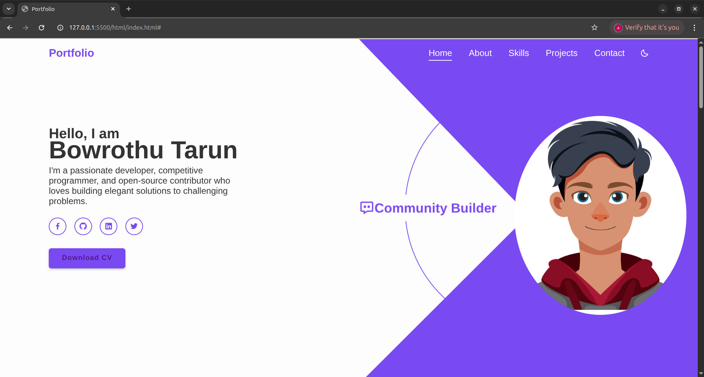
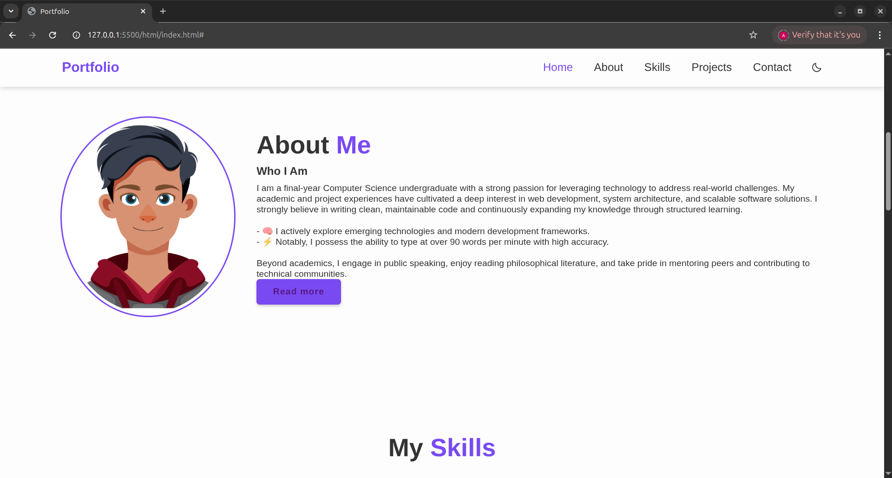

# PERSONAL_PORTFOLIO_CODETECH

## 🏢 Internship Details

- **Company:** CODTECH IT Solutions
- 
- **Name:** Saketi JayanthKumar

- **Intern ID:** :CT04DG107

- **Domain:** Front-End Development  

- **Duration:** 4 Weeks

- **Mentor:** Neela Santhosh

# 🌐 Developer Portfolio - Bowrothu Tarun

Welcome to my personal **developer portfolio website** — a beautifully crafted, fully responsive, and interactive web application built using modern web development technologies. This site serves as my digital identity, showcasing my skills, projects, and journey as a web developer, open-source contributor, and computer science student.

---

## 📖 Overview

This portfolio website is a single-page application designed to provide a clean and professional introduction to who I am, what I do, and what I’ve built. From elegant animations to interactive components, it demonstrates my front-end development expertise and commitment to writing clean, modular, and responsive code.

Whether you’re a recruiter, collaborator, or fellow developer, this site is an open window into my work and capabilities.

---

## 🚀 Features

- Fully responsive design for mobile, tablet, and desktop
- Smooth animations powered by ScrollReveal.js
- Profession rotating carousel using Swiper.js
- Toggleable dark/light mode
- Interactive navigation with section highlighting
- Project showcase with animated overlays
- Functional contact form UI
- Social media integration with boxicons
- Clean, accessible markup and styling

---

## 🛠️ Tech Stack

**Frontend:**
- HTML5
- CSS3
- JavaScript (Vanilla)
- Boxicons (for UI icons)
- Swiper.js (for carousel)
- ScrollReveal.js (for animations)

**Design & Responsiveness:**
- Flexbox & CSS Grid
- Media queries
- Mobile-first approach

**Version Control & Deployment:**
- Git & GitHub

---

## 📁 Folder Structure

portfolio-website/
│
├── index.html         # Main HTML file
├── style.css          # Main stylesheet
├── index.js           # JavaScript file for interactivity and animations
├── /img/              # Folder for avatar and project illustrations
└── README.md          # Project documentation (this file)

---

## 📚 What I Learned

Building this portfolio helped me grow and solidify my understanding of several key frontend development concepts, such as:

- **Responsive Web Design:** Using media queries, Flexbox, and Grid systems to ensure cross-device compatibility.
- **Interactive UI:** Creating engaging elements using JavaScript and third-party libraries.
- **Modular CSS Structure:** Writing clean, maintainable styles.
- **Dark Mode Toggle:** Implementing JavaScript logic to switch themes dynamically.
- **Animation Principles:** Leveraging ScrollReveal and Swiper for interactive user experience.
- **Project Deployment & Version Control:** Understanding how to manage, commit, and push code responsibly using Git.

---

## 📸 Screenshots of My Work

## 🧠 About Me

I’m a final-year Computer Science undergraduate who’s passionate about building real-world solutions through code. My interests lie in full-stack web development, system design, and open-source software. I enjoy turning complex problems into simple, beautiful, and intuitive interfaces.

- 💡 Self-motivated learner and technology enthusiast
- 🔥 Competitive programmer with strong grasp in C++
- 🎯 Strong focus on clean, efficient code and performance
- 📚 Interested in reading philosophy and mentoring peers

---

> Built with ❤️ by Bowrothu Tarun — Thank you for visiting!

Happy coding!
